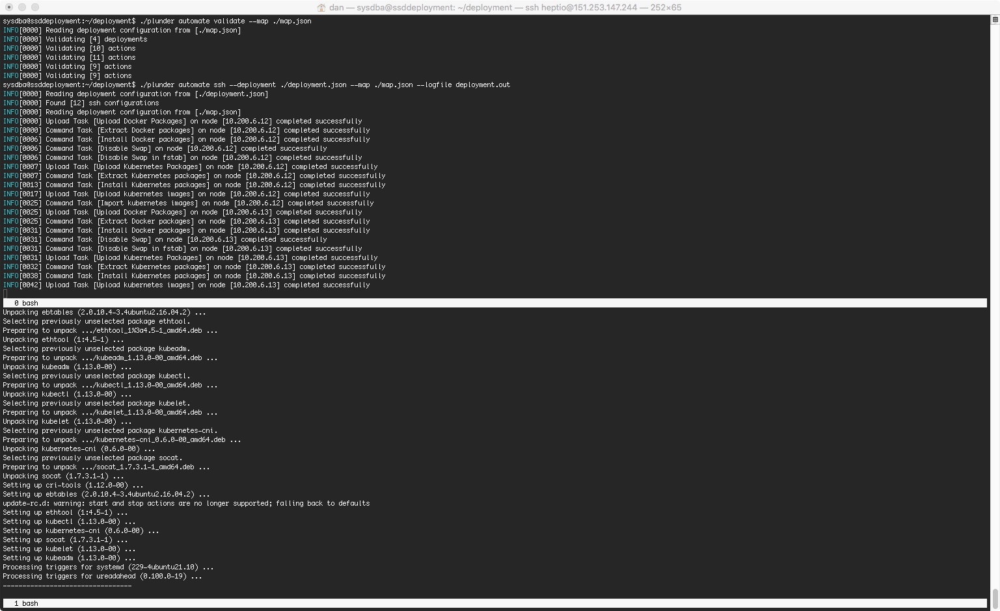

# Provisioning Configuration

The provisioning works by running remote commands or uploading/downloading files to a remote system, in order for it to be configured correctly. A parsing engine called "parlay" was written in order to provide repeatable scripting to ease deployments.

A Deployment map can contain multiple **deployments**, which in turn will contain one or more **actions** that will be performed on one or more **hosts**.

Also a deployment map can be parsed as either **JSON** or as **YAML** (yaml being somewhat easier to read as a human and creating much smaller files).

### Example deployment map

This script below (for offline installations) will upload a tarball containing the docker packages and then install them on all remote systems listed under `hosts`.

**Note** the tarball was created by `apt-get download docker-ce=18.06.1~ce~3-0~ubuntu; tar -cvzf docker_pkg.tar.gz ./docker-ce_18.06.1~ce~3-0~ubuntu_amd64.deb`

#### JSON Example

```json
{
	"deployments": [
		{
			"name": "Upload Docker Packages",
			"parallel": false,
			"sessions": 0,
			"hosts": [
				"192.168.1.3",
				"192.168.1.4",
				"192.168.1.5"
			],
			"actions": [
				{
					"name": "Upload Docker Packages",
					"type": "upload",
					"source": "./docker_pkg.tar.gz",
					"destination": "/tmp/docker_pkg.tar.gz"
				},
				{
					"name": "Extract Docker packages",
					"type": "command",
					"command": "tar -C /tmp -xvzf /tmp/docker_pkg.tar.gz"
				},
        {
					"name": "Install Docker packages",
					"type": "command",
					"command": "dpkg -i /tmp/docker/*",
					"commandSudo": "root"
				}
			]
		}
	]
}
                                
```
#### YAML Example

```yaml
deployments:
- actions:
  - destination: /tmp/docker_pkg.tar.gz
    name: Upload Docker Packages
    source: ./docker_pkg.tar.gz
    timeout: 0
    type: upload
  - command: tar -C /tmp -xvzf /tmp/docker_pkg.tar.gz
    name: Extract Docker packages
    timeout: 0
    type: command
  - command: dpkg -i /tmp/docker/*
    commandSudo: root
    name: Install Docker packages
    timeout: 0
    type: command
  hosts:
  - 192.168.1.3
  - 192.168.1.4
  - 192.168.1.5
  name: Upload Docker Packages
  parallel: false
  parallelSessions: 0
```

The above example only covers simple usage of `uploading` and `command` usages.


## Usage

When automating a deployment ssh credentials are required to map a host with the correct credentials. 

To simplify this `plunder` can make use of:

- A `deployment` file as detailed [here](./deployment.md), which parlay will extract the `ssh` information from to allow authentication
- A **deployment endpoint**, which is effectively the url of a running plunder instance. Parlay will evaluate the endpoint for the configuration details to allow authentication. 

**Example**

Using a map to deploy wordpress (`wordpress.yaml`) and a local deployment file.

`plunder automate ssh --map ./wordpress.yaml --deployconfig ./deployment.json`

Using a map to deploy wordpress (`wordpress.yaml`) and a deployment endpoint.

`plunder automate ssh --map ./wordpress.yaml --deployendpoint http://localhost`

It is possible to override or completely omit deployment configuration and specify the configuration at runtime through the flags `--override{Address/Keypath/Username}`. By **default** plunder will attempt to populate the Keypath and username from the current user and their `$HOME/.ssh/` directory.

`/plunder automate --map ./stackedmanager.yaml --overrideAddress 192.168.1.105`

Under most circumstances plunder will execute all actions in every deployment (on every host in the deployment), however it is possible to tell plunder to execute a single deployment/action from a map and on which particular host.

Additional Flags:

- The `--deployment` flag now will point to a specific deployment in a map
- The `--action` flag can be used to point to a specific action in a deployment
- The `--host` flag will point to a specific host in the deployment
- The `--resume` will determine if to continue executing all remaining actions

### User Interface

Plunder can also make automation easier by providing a user interface for a map and allowing the user to select which Deployments, actions and the hosts that will be acted upon. To use the user interface the subcommand `ui` should be used, all other flags are the same as above.

**Example**

```
plunder automate ui --map ./stackedmanager.yaml --deployendpoint http://localhost 
INFO[0000] Reading deployment configuration from [./stackedmanager.yaml] 
? Select deployment(s)  [Use arrows to move, type to filter]
> [ ]  Reset any Kubernetes configuration (and remove packages)
  [ ]  Configure host OS for kubernetes nodes
  [ ]  Deploy Kubernetes Images for 1.14.0
  [ ]  Initialise Kubernetes Master (1.14)
  [ ]  Deploy Calico (3.6)
```

The UI also provides additional capability to create new maps based upon selected deployments and actions, and also to convert between formats. 

- `--json` Print the JSON to stdout, no execution of commands
- `--yaml` Print the YAML to stdout, no execution of commands


**Execution of a map is shown in the screen shot below**


*The above example uses screen, where the output from `plunder` is on the top and `tail -f output` is below*


